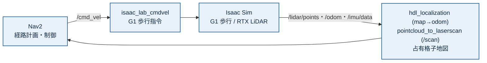

# humanoid-isaac-ros2 Isaac Sim ナビゲーション環境<br>構築・ナビ実行ガイド

本ドキュメントは、ヒューマノイド **Unitree G1** を Isaac Sim 上で歩行させ、LiDAR でセンシングを行い、ROS 2 と連携させるためのリポジトリ `humanoid-isaac-ros2` を、**ワークステーション上に構築し、シミュレータと ROS 2 連携を起動し、さらに Nav2 による自律ナビゲーションを実行するところまで**を解説します。

前半（第1部・第2部）は時間のかかる**環境構築フェーズ**、後半（第3〜5部）は **コンテナ基盤の構築・地図作成・Nav2 ナビゲーションの実行フェーズ**を扱います。

ソフトウェアスタックは以下を前提とします。

- **Isaac Sim 5.0** + **Isaac Lab 2.2**（公式構成）
- **ROS 2 Humble**（Isaac Sim 互換ワークスペースをソースビルド）
- **Docker**（地図作成・自己位置推定 (localization)・VNC などの周辺コンテナ用。本書では導入のみ）
- Python 仮想環境 `env_isaaclab_2.2`（**Python 3.11**）

---

## はじめに

### 対象読者

Isaac Sim / Isaac Lab を新規ワークステーションに構築し、`humanoid-isaac-ros2` を立ち上げる技術担当者を想定します。Linux のコマンドライン、`git`、`docker`、`pip` の基本操作を理解されている読者を前提とします。

### 本ガイドの構成 ―― 全 6 部構成

本ガイドは、`humanoid-isaac-ros2` の**ソースコードが手元に無くても進められる作業**と、**ソース受領後の構築**、そして**ナビゲーションの実行**を明確に分けています。

| 部 | 内容 | ソース | 実施タイミング |
|---|---|---|---|
| **第1部　事前準備** | Isaac Sim/Lab、ROS 2 ビルド、Docker、ハードウェア要件 | **不要** | ソース受領前に先行実施可能 |
| **第2部　ソース受領後の構築と起動** | リポジトリ取得、`pip install`、起動 | 必要 | ソース受領後 |
| **第3部　コンテナ基盤の構築** | nav_vnc・依存導入(setup.sh)・共通設定・hdl イメージ（地図/ナビ共通） | 必要 | ナビ・地図作成の前に一度 |
| **第4部　地図作成（SLAM）** | GLIM で地図を自作 → PCD → 占有格子地図 | 必要 | ナビ前（地図を自作する場合） |
| **第5部　ナビゲーションの実行** | hdl 自己位置推定・Nav2・RViz でのゴール指示 | 必要 | 地図作成後 |

> **補足**: 第1部はすべて公開ソフトウェア（Isaac Sim/Lab・ROS 2・Docker）で構成され、本リポジトリのソースは不要です。先に第1部を済ませておくと、Docker イメージ取得・ROS 2 ワークスペースのビルド・Isaac Sim の初回シェーダコンパイルといった**時間のかかる処理を前倒し**でき、ソース受領後すぐに第2部へ進めます。

### 構築フェーズの全体像

<!--FLOW_IMG_START-->

**第1部　事前準備（ソースコード不要・先行実施可）**
ハード/ソフト要件・NVIDIA ドライバ → Docker + NVIDIA Container Toolkit → Isaac Sim 5.0 / Isaac Lab 2.2（venv `env_isaaclab_2.2`, Python 3.11）→ ROS 2 Humble + IsaacSim-ros_workspaces（`build_ros.sh`）

**↓ ソース受領**

**第2部　ソース受領後の構築と起動**
`humanoid-isaac-ros2` 取得 → `pip install -e`（依存も自動導入）→ `run_locomotion.sh` で起動 → 起動確認（ROS topics）

**↓ 構築完了**

**第3部　コンテナ基盤の構築（地図作成・ナビ共通）**
nav_vnc コンテナ作成 → `setup.sh`（依存導入＋ビルド）→ hdl イメージ build → nav_vnc 内 共通設定

**↓**

**第4部　地図作成（SLAM）**※自作する場合
GLIM(SLAM) → 点群(PLY) → PCD(intensity) → 占有格子(PGM, `pcd2pgm`)

**↓**

**第5部　ナビゲーションの実行**
hdl_localization（Docker）→ pointcloud_to_laserscan → Nav2（`bringup_no_amcl`）→ RViz → 「Nav2 Goal」で自律移動

<!--FLOW_IMG_END-->

### 所要時間の目安

| フェーズ | 所要時間 |
|---|---|
| 第1部 Isaac Sim / Isaac Lab 導入（ドライバ導入済み） | 60〜90 分 |
| 第1部 ROS 2 Humble + ワークスペースのソースビルド | 30〜60 分 |
| 第2部 リポジトリ取得（Git LFS 含む、約 0.5 GB） | 5〜15 分 |
| 第2部 Python パッケージ導入・起動確認 | 10〜20 分 |
| 第3部 コンテナ基盤の構築（イメージ build・依存導入） | 20〜40 分 |
| 第5部 ナビゲーションの起動・実行 | 10〜20 分 |

> **補足**: 初回は Isaac Sim のシェーダコンパイルやアセット取得に時間がかかります。2 回目以降の起動は、初回に生成されたシェーダキャッシュが再利用されるため大幅に短縮されます。

---

## 第1部　事前準備（ソースコード不要）

> **この部について**: ここに記載する作業は `humanoid-isaac-ros2` のソースが無くても実施できます。**ソース受領前に先行して完了**しておけます。

### 1.1　ハードウェア要件

| 項目 | 必須 / 推奨 | 仕様 |
|---|---|---|
| CPU | 必須 | x86_64、8 コア以上 |
| メモリ | 必須 / 推奨 | 32 GB 以上必須、64 GB 以上推奨 |
| GPU | 必須 | NVIDIA RTX シリーズ（**RTX LiDAR を使うため RTX/OptiX 対応必須**、VRAM 12 GB 以上）。RTX 4090 / 5090、RTX A5000 以上を推奨 |
| ストレージ | 必須 | NVMe SSD 200 GB 以上の空き領域 |

> **GPU について**: 本環境は RTX LiDAR センサ（レイトレーシング / OptiX）を使用します。**NVIDIA RTX GPU でレンダリングが行われていること**が前提です。複数 GPU 構成では、Isaac Sim が RTX GPU を使用していることを起動ログで確認してください（§2.4 参照）。

### 1.2　ソフトウェア要件・バージョン

| 項目 | バージョン |
|---|---|
| OS | **Ubuntu 22.04 LTS** |
| NVIDIA Driver | 535.x 以上（RTX 50 系は 555.x 以上） |
| CUDA | 12 系（Isaac Sim 同梱） |
| Docker Engine | 24.x 以上 |
| NVIDIA Container Toolkit | 1.14 以上 |
| Isaac Sim | **5.0** |
| Isaac Lab | **2.2** |
| ROS 2 | **Humble** |
| Python（Isaac 環境） | **3.11**（venv `env_isaaclab_2.2`） |

### 1.3　NVIDIA ドライバの導入

GPU ドライバが未導入の場合、Ubuntu 標準の自動インストーラが簡便です。

```bash
sudo ubuntu-drivers autoinstall
sudo reboot
```

再起動後、GPU が認識されていることを確認します。

```bash
nvidia-smi
```

> **ドライバが入らない / `nvidia-smi` が動かない場合**: 検証環境では **`nvidia-driver-580-open`（580.159.03）** で動作確認しています。`autoinstall` でうまくいかない場合は、同じ open kernel module 版を明示的に導入してください。
>

```bash
sudo apt install -y nvidia-driver-580-open
sudo reboot
```

>
> RTX 50 系などで open kernel module が必要な構成があります。`nvidia-smi` の `Driver Version` が `580.x` 系になっていれば本ガイドの検証環境と同等です。

### 1.4　Docker および NVIDIA Container Toolkit の導入

地図作成・自己位置推定 (localization)・VNC などの周辺コンテナはすべて Docker で動かします（実行は運用フェーズ）。事前に Docker と GPU 連携を整えておきます。

```bash
# Docker Engine
curl -fsSL https://get.docker.com | sudo sh
sudo usermod -aG docker $USER
newgrp docker

# NVIDIA Container Toolkit（公式手順に従う）
# https://docs.nvidia.com/datacenter/cloud-native/container-toolkit/latest/install-guide.html
sudo nvidia-ctk runtime configure --runtime=docker
sudo systemctl restart docker
```

確認:

```bash
docker run --rm --gpus all nvidia/cuda:12.2.0-base-ubuntu22.04 nvidia-smi
```

### 1.5　Isaac Sim 5.0 / Isaac Lab 2.2 と ROS 2 Humble の導入

#### Isaac Sim / Isaac Lab

Isaac Sim 5.0 / Isaac Lab 2.2 は NVIDIA 公式の pip インストール手順で導入します（公式: <https://isaac-sim.github.io/IsaacLab/release/2.2.0/source/setup/installation/pip_installation.html>）。検証環境の構成は次のとおりです。

**1) Python 3.11 環境（conda → venv の二段構成）**

```bash
conda create -y -n _py311_bootstrap python=3.11
# 上記 conda の python から venv を作成（--copies）
~/miniconda3/envs/_py311_bootstrap/bin/python -m venv --copies ~/env_isaaclab_2.2
source ~/env_isaaclab_2.2/bin/activate
pip install --upgrade pip
```

**2) Isaac Sim 5.0 を pip で導入**

```bash
pip install 'isaacsim[all,extscache]==5.0.0' --extra-index-url https://pypi.nvidia.com
```

**3) Isaac Lab 2.2 を clone して導入（タグ `v2.2.0`）**

```bash
git clone https://github.com/isaac-sim/IsaacLab.git -b v2.2.0 ~/IsaacLab_2.2
cd ~/IsaacLab_2.2
# 【重要】isaaclab 本体の依存 flatdict は、新しい pip のビルド隔離環境
# （pkg_resources が無い）だとビルドに失敗します。隔離なしで先に導入してください。
pip install 'flatdict==4.0.1' --no-build-isolation
./isaaclab.sh --install
```

> **flatdict について**: `pip install 'flatdict==4.0.1' --no-build-isolation` を省くと、`./isaaclab.sh --install` が `ModuleNotFoundError: No module named 'pkg_resources'` で `isaaclab` 本体のビルドに失敗します（他の拡張は入るのに本体だけ入らず、`import isaaclab` が通らない状態になります）。`--no-build-isolation` は venv 側の `setuptools`（`pkg_resources` を含む）を使うため回避できます。

> **⚠️ 重要（`--install` 後に torch を再固定）**: `./isaaclab.sh --install` は強化学習拡張（rsl-rl / skrl / stable-baselines3 / robomimic 等）の依存解決の過程で、**torch を `2.7.0` から新しい版（例 `2.12.x+cu130`）へ勝手に引き上げる**ことがあります。isaacsim は `torch==2.7.0` を要求するため不整合になりますが、pip は incompatible 警告を出すだけで続行し、`import isaacsim` / `import isaaclab` は通ってしまうため気づきにくい一方、第2部の `run_locomotion.sh` 実行時に **isaacsim のコンパイル済み拡張が ABI 不一致で落ちる**恐れがあります。`--install` 後は必ず torch を確認し、`2.7.0` でなければ cu128 版に戻してください（cu128 は RTX 50 系 / sm_120 で動作実績のある構成）。

```bash
# 現状確認（2.7.0 以外なら下で戻す）
python -c "import torch; print(torch.__version__)"
# isaacsim が要求する版へ再固定（torch / torchvision / torchaudio をまとめて）
pip install torch==2.7.0 torchvision==0.22.0 torchaudio==2.7.0 --index-url https://download.pytorch.org/whl/cu128
```

> 再固定後に stable-baselines3（`torch>=2.8` を要求）や packaging の incompatible 警告が残りますが、これらは強化学習の学習用途のみに関係し、本ガイドのナビゲーション（isaacsim ＋ ONNX ポリシー）の動作には影響しません。

**4) 確認（初回は EULA 同意が必要）**

初回の `import isaacsim` / Isaac Sim 起動時に NVIDIA ライセンス (EULA) への同意を求められます。プロンプトに従って `Yes` で同意してください。

```bash
source ~/env_isaaclab_2.2/bin/activate
python -c "import isaacsim, isaaclab; print('isaacsim/isaaclab OK')"
```

> **補足（この二段構成について）**: 検証環境では conda 環境の Python (3.11) から `venv` を作る二段構成です。`env_isaaclab_2.2` の標準ライブラリは conda 側を参照するため、Isaac Sim 起動時に `libexpat` の差異が出ますが、これは第2部の `run_locomotion.sh` が自動で吸収します。

#### ROS 2 Humble と Isaac Sim 互換ワークスペース

まず ROS 2 Humble 本体を導入します（公式手順準拠: <https://docs.ros.org/en/humble/Installation.html>）。

```bash
# ロケール設定
sudo apt update && sudo apt install -y locales
sudo locale-gen en_US en_US.UTF-8
sudo update-locale LC_ALL=en_US.UTF-8 LANG=en_US.UTF-8

# apt リポジトリの追加
sudo apt install -y software-properties-common curl
sudo add-apt-repository -y universe
sudo curl -sSL https://raw.githubusercontent.com/ros/rosdistro/master/ros.key \
  -o /usr/share/keyrings/ros-archive-keyring.gpg
echo "deb [arch=$(dpkg --print-architecture) signed-by=/usr/share/keyrings/ros-archive-keyring.gpg] http://packages.ros.org/ros2/ubuntu $(. /etc/os-release && echo $UBUNTU_CODENAME) main" \
  | sudo tee /etc/apt/sources.list.d/ros2.list > /dev/null

# ROS 2 Humble 本体 + 開発ツール（build_ros.sh が rosdep/colcon を使うため dev-tools も導入）
sudo apt update
sudo apt install -y ros-humble-desktop ros-dev-tools
```

確認:

```bash
source /opt/ros/humble/setup.bash
ros2 --help >/dev/null && echo "ROS 2 Humble OK"
```

そのうえで、Isaac Sim の Python (3.11) から `rclpy` を使えるようにするため、NVIDIA 配布の `IsaacSim-ros_workspaces` を**ソースビルド**します（このリポジトリは NVIDIA 公式であり、本プロジェクトのソースではありません）。`build_ros.sh` は **Docker コンテナ内でワークスペースをビルドし、成果物を `docker cp` でホストへ取り出します**（`rosdep` による依存解決もコンテナ内で行われるため、ホスト側の `rosdep init/update` は不要で、第1部 §1.4 の Docker 導入が前提です）。なお上記の ROS 2 Humble 本体は、第2部以降でホストから `ros2` コマンドを使うために必要です。

```bash
git clone -b IsaacSim-5.0.0 --single-branch \
  https://github.com/isaac-sim/IsaacSim-ros_workspaces.git
cd IsaacSim-ros_workspaces
./build_ros.sh -d humble -v 22.04
```

ビルド後、`build_ws/humble/` 配下に Python 3.11 向けの ROS 2（rclpy 等）が生成されます。生成物の確認:

```bash
ls ~/IsaacSim-ros_workspaces/build_ws/humble/humble_ws/install/local/lib/python3.11/dist-packages/rclpy/__init__.py
```

> **補足**: 起動時のワークスペース読み込み（`source`）や RMW 設定は、第2部の起動スクリプト `run_locomotion.sh` が自動的に行います。

---

## 第2部　ソース受領後の構築と起動

> **この部について**: ここからは `humanoid-isaac-ros2` のソースコードを受領した後に実施します。第1部が完了している前提で進めます。

### 2.1　humanoid-isaac-ros2 一式の取得（圧縮ファイルの解凍）

本ソフトウェア一式は、**配布された圧縮ファイル `humanoid-isaac-ros2-full.tar.gz` を解凍**して取得します。USD・ONNX・PCD などのバイナリも**実体が展開済み**で含まれるため、**Git / Git LFS の操作は不要**です。

```bash
cd ~/work        # 任意の作業ディレクトリ（ここに解凍する）
tar xzf /path/to/humanoid-isaac-ros2-full.tar.gz   # 受領した圧縮ファイルのパスを指定
cd humanoid-isaac-ros2
```

解凍すると `humanoid-isaac-ros2/`（中に `HumanoidPoC/`・`unitree/`・`docs/` など）が現れます。以降のコマンドはこの直下（`~/work/humanoid-isaac-ros2`）を基準に実行します。圧縮ファイルには USD 等の実体が含まれるため、展開後すぐ第2.2部へ進めます。

### 2.2　Python パッケージのインストール

`env_isaaclab_2.2` を有効化した状態で、リポジトリ内の editable パッケージを導入します。`onnxruntime` や `netifaces` などの依存はパッケージ定義に含まれており**自動で導入**されます。

```bash
source ~/env_isaaclab_2.2/bin/activate

# 1) HumanoidPoC（依存も自動導入）
cd ~/work/humanoid-isaac-ros2/HumanoidPoC
pip install -e source/HumanoidPoC

# 2) unitree_rl_lab
cd ~/work/humanoid-isaac-ros2/unitree/unitree_rl_lab
pip install -e source/unitree_rl_lab

# 3) ROS 2 の TF ツール
sudo apt install -y ros-humble-tf2-ros
```

### 2.3　シミュレータの起動

起動はリポジトリ同梱のラッパースクリプトで行います。

```bash
cd ~/work/humanoid-isaac-ros2
./HumanoidPoC/scripts/run_locomotion.sh
```

このスクリプトは、Isaac Sim を ROS 2 と連携起動するために必要な環境設定（ROS 2 ワークスペースの読み込み、RMW を CycloneDDS に設定、インタプリタの `libexpat` の読み込み）を**内部で自動的に行います**。各パスは環境変数で上書きできます。

| 環境変数 | 既定値 | 用途 |
|---|---|---|
| `ISAAC_PY` | `~/env_isaaclab_2.2/bin/python` | Isaac 環境の Python |
| `ISAAC_ROS_WS` | `~/IsaacSim-ros_workspaces/build_ws/humble` | ビルド済み ROS 2 ワークスペース |
| `RMW_IMPLEMENTATION` | `rmw_cyclonedds_cpp` | 周辺コンテナと揃える DDS 実装 |
| `ROS_DOMAIN_ID` | `0` | ROS ドメイン |

初回はシェーダコンパイル等で数分かかります。起動ログで以下を確認してください。

- **使用 GPU が RTX であること**（GPU 一覧で `Active` 列が `Yes` の行に `NVIDIA GeForce RTX ...` が表示される）
- エラー・Traceback が出ていないこと
- ROS パブリッシャ `isaac_lab_pub` が動き始めること

### 2.4　起動確認（ROS 2 トピック）

別ターミナルでトピックを確認します。**ROS 2 CLI は Python 3.11（Isaac の venv）で実行する必要がある**ため、付属ラッパ `ros2_host.sh` を使います（ワークスペースの source・RMW・`LD_LIBRARY_PATH` を自動設定）。

```bash
cd ~/work/humanoid-isaac-ros2
./HumanoidPoC/scripts/ros2_host.sh topic list
```

> **なぜラッパが必要か**: ワークスペースの `ros2` スクリプトの shebang は `env python3` で、環境によってはシステムの **Python 3.10** を拾います。すると 3.11 でビルドされた rclpy の C 拡張を読めず
> `ModuleNotFoundError: No module named 'rclpy._rclpy_pybind11'`（`cpython-310` の `.so` を探す）で失敗します。`ros2_host.sh` は venv の python(3.11) を絶対パスで使って `ros2` を起動するため、この問題を回避します。手打ちする場合は次と等価です：

```bash
source ~/env_isaaclab_2.2/bin/activate
source ~/IsaacSim-ros_workspaces/build_ws/humble/humble_ws/install/setup.bash
source ~/IsaacSim-ros_workspaces/build_ws/humble/isaac_sim_ros_ws/install/local_setup.bash
export RMW_IMPLEMENTATION=rmw_cyclonedds_cpp ROS_DOMAIN_ID=0
export LD_LIBRARY_PATH=$(~/env_isaaclab_2.2/bin/python -c 'import sys;print(sys.base_prefix)')/lib:$LD_LIBRARY_PATH
~/env_isaaclab_2.2/bin/python "$(which ros2)" topic list
```

以下のようなトピックが出力されれば、シミュレータと ROS 2 連携が正常に立ち上がっています。

```text
/clock
/cmd_vel
/imu/data
/lidar/points
/odom
/tf
/tf_static
...
```

ロボットを歩かせるには、別ターミナルから `/cmd_vel` に Twist を送ります。`teleop_twist_keyboard` は **`nav_vnc` コンテナ内**で実行します（teleop と CycloneDDS の両方が入っており、ホストネットワーク共有で Isaac に届くため）。`ros2_host.sh`（Isaac 専用 WS）には teleop が無く `not found` に、ホスト素の `ros2` は CycloneDDS が無く RMW 不一致になります。

```bash
docker exec -it nav_vnc bash
# ↓ nav_vnc 内（§3.4 共通設定）
source /opt/ros/humble/setup.bash
export RMW_IMPLEMENTATION=rmw_cyclonedds_cpp
export ROS_DOMAIN_ID=0
ros2 run teleop_twist_keyboard teleop_twist_keyboard   # i=前進 / ,=後退 / j,l=旋回 / k=停止
```

> **補足（RTX LiDAR の点群）**: Isaac Sim ウィンドウが非表示・最小化のとき、`/lidar/points` が空になる（ログに `skip publishing empty point cloud` が出る）ことがあります。これは RTX LiDAR が描画フレームを得られていない状態です。ウィンドウを**前面に表示**して描画されている状態にすると点群が得られます。

ここまでで**環境構築フェーズ（第1部・第2部）は完了**です。続いて第3部でコンテナ基盤（nav_vnc・hdl）を構築し、第4部で地図を作成（自作する場合）、第5部で Nav2 による自律ナビゲーションを実行します。

---

## 第3部　コンテナ基盤の構築（地図作成・ナビ共通）

第4部（地図作成）と第5部（ナビゲーション）は、いずれも **`nav_vnc` という Docker コンテナ**と、自己位置推定用の **hdl イメージ**を使います。これらは両者の共通基盤なので、**先にここで一度だけ用意**します。新規環境では必須です。

> **なぜ先に作るか**: 地図作成の最終段（PCD → 占有格子 / `pcd2pgm`）も、ナビ本体（Nav2 / laserscan / RViz）も、どちらも `nav_vnc` コンテナの中で実行します。コンテナを作る前にコンテナ内コマンド（`source /ros2_ws/...` 等）をホストで叩くと、`/ros2_ws` はコンテナ内パスのため `No such file or directory` になります。だから**基盤づくりを最初にまとめます**。

### 3.1　nav_vnc コンテナの作成

Nav2 / pointcloud_to_laserscan / RViz、および地図作成の `pcd2pgm` は **`nav_vnc` という Docker コンテナ内**で動かします。ROS 2 ＋ デスクトップ(VNC) 入りの `tiryoh/ros2-desktop-vnc` を、**ホストネットワーク**＋リポジトリの**マウント**付きで起動します。

```bash
cd <repo>/HumanoidPoC/ros2
docker run -d --name nav_vnc --network host \
  -v "$PWD/ros2_ws:/ros2_ws" \
  -v "$PWD/volume:/volume" \
  ghcr.io/tiryoh/ros2-desktop-vnc:humble
```

- `--network host`：Isaac（ホスト）と CycloneDDS でトピックを共有するため。
- マウント：`ros2_ws`（ビルド対象）と `volume`（地図・設定）を、コンテナ内 `/ros2_ws`・`/volume` に。
- デスクトップはブラウザで `http://localhost:6080/vnc.html`（既定パスワード `ubuntu`）から入れます。

### 3.2　ROS 2 パッケージのビルド／依存導入（setup.sh・コンテナ内）

同梱スクリプトが navigation2 / pcd2pgm / hdl 系などを clone して `colcon build` します。**あわせて `rmw_cyclonedds_cpp`・PCL などの apt 依存もコンテナ内に導入します**。`/ros2_ws` のビルド成果はマウント共有していても、この **apt 依存はコンテナごとに必要**（新規 nav_vnc には CycloneDDS が入っていない）ため、**`setup.sh` は各コンテナで必ず実行**してください。未実行だと Nav2/laserscan が `librmw_cyclonedds_cpp.so` を読めず起動に失敗します。

```bash
docker exec -it nav_vnc bash -lc '/volume/setup_scripts/setup.sh'
```

> **既知の問題（hdl_global_localization のビルド停止）**: `setup.sh` の `colcon build` が `hdl_global_localization` で `nlohmann/json` のバージョン競合により停止することがあります。ただし**自己位置推定は §3.3 の事前ビルド済み hdl イメージで動かす**ため、`poc_launch` / `poc_utils` がビルドできていれば**そのまま先へ進めます**（hdl のソースビルドは不要）。`navigation2` / `pointcloud_to_laserscan` が未ビルドなら apt で補えます：

```bash
docker exec -it nav_vnc bash -lc 'sudo apt-get update && sudo apt-get install -y ros-humble-navigation2 ros-humble-nav2-bringup ros-humble-pointcloud-to-laserscan'
```

ビルド確認（`poc_launch` / `poc_utils` が見えれば OK）：

```bash
docker exec -it nav_vnc bash -lc 'source /opt/ros/humble/setup.bash; source /ros2_ws/install/setup.bash; ros2 pkg list | grep -E "poc_launch|poc_utils"'
```

### 3.3　hdl_localization イメージのビルド

自己位置推定は Docker イメージ `lidar_localization:humble` を使います（`nav_vnc` とは別コンテナ・ホストで実行）。新規環境では同梱 Dockerfile からビルドします。

```bash
cd <repo>/HumanoidPoC/ros2
docker compose -f docker/docker-compose.hdl_localization.yml build
```

（`docker/Dockerfile.hdl_localization` から `lidar_localization:humble` が作られます。NVIDIA Container Toolkit が前提。）

**プロキシ環境などでビルドが失敗する場合（`git clone` が通らない）**: このビルドは GitHub から複数のソース（gtsam・ndt_omp・fast_gicp・hdl_global_localization・hdl_localization・pcd_publisher）を `git clone` します。**プロキシ等で GitHub への clone がブロックされる環境では、このビルドが失敗**します（`apt` やベースイメージ取得は通っても clone だけ失敗）。その場合は**ビルドせず、配布されたビルド済みイメージ `lidar_localization_humble.tar.gz` を読み込んで**ください。

受け取った `lidar_localization_humble.tar.gz` は**任意の場所に置いて構いません**（リポジトリの解凍とは異なり、**展開先ディレクトリは不要**です。`docker load` がイメージを Docker 本体に取り込みます）。ファイルを置いたディレクトリで実行するか、フルパスを指定して実行します。

```bash
# 受け取った tar.gz のパスを指定して読み込む（置き場所は任意）
gunzip -c /path/to/lidar_localization_humble.tar.gz | docker load   # → lidar_localization:humble が登録される
docker images lidar_localization:humble                              # 登録確認（表示されれば成功）
```

読み込めれば §3.3 のビルドは不要です。そのまま第4部以降（hdl_localization の起動）に進めます。配布イメージは、ビルドできる環境で `docker save lidar_localization:humble | gzip > lidar_localization_humble.tar.gz` で作成したものです。

### 3.4　nav_vnc 内の共通設定（以降の nav_vnc 内コマンドの前提）

第4部の `pcd2pgm`、第5部の laserscan / Nav2 / RViz は、すべて **`nav_vnc` コンテナの中**で実行します。**nav_vnc 内で作業する各ターミナルごとに**、まず次を実行してください（`docker exec -it nav_vnc bash` で入ると **`root@<id>`** プロンプトになります。RViz だけは VNC 表示の都合で `-u ubuntu` 指定が必要＝§5.3.4 参照）。

```bash
# ホストで：コンテナに入る
docker exec -it nav_vnc bash

# ↓ ここから nav_vnc コンテナ内（作業する各ターミナルで毎回）
source /opt/ros/humble/setup.bash
source /ros2_ws/install/setup.bash         # poc_launch / poc_utils を含む
export RMW_IMPLEMENTATION=rmw_cyclonedds_cpp
export ROS_DOMAIN_ID=0
```

> 以降のドキュメントで「**nav_vnc 内で**」と書かれたコマンドは、この共通設定を済ませた端末で実行してください。VNC デスクトップの端末でも同様です。

---

## 第4部　地図作成（SLAM → 占有格子地図）

第5部のナビは**占有格子地図（`*_occgrid.pgm`）**を使います。付属の `lightwheel_map` 以外を使う場合、シミュレータ内で **GLIM（SLAM）** により自作できます。流れは **SLAM → 点群(PLY) → PCD(intensity付与) → 占有格子(PGM)** です。最終段（§4.4）は第3部で用意した `nav_vnc` を使います。

> **⚠️ GUI コンテナの X11 許可（§4.1 SLAM・§4.2 ビューア共通）**: GLIM の SLAM GUI（`create_map.yml`）とオフラインビューア（`viewer.yml`）は、ホストの X サーバに描画する GUI アプリです。コンテナ（root）に X アクセスを許可していないと、`Authorization required ... / X11: Failed to open display / failed to initialize GLFW / Segmentation fault` で落ちます。**起動前にホスト側で一度**次を実行してください（X を再起動／ログアウトするまで有効）。

```bash
xhost +local:root        # 直らなければ xhost +local:（ローカル接続を全許可）
```

> `DISPLAY` はホストの実値（例 `:1`）が compose に渡るため変更不要です。作業後は `xhost -local:root` で元に戻せます。

### 4.1　GLIM で SLAM 地図を作成（ホスト）

**1. Isaac を起動し前面に**します（`run_locomotion.sh`、§2.3。前面が必要な理由は §2.4）。

**2. `/lidar/points`・`/imu/data` が出ていることを確認します。** ⚠️ **ここが無い／空のまま GLIM を起動すると、データ不足でオドメトリが発散し地図が作れません（または崩れます）。必ず点が出てから次へ進んでください**（出ていなければ Isaac を前面化）。

```bash
# 点群が来ているか（点数 width が返ればOK。例: 32768）
./HumanoidPoC/scripts/ros2_host.sh topic echo /lidar/points --field width --once
# IMU が来ているか（メッセージが1件返ればOK）
./HumanoidPoC/scripts/ros2_host.sh topic echo /imu/data --once
```

> **補足（`topic hz` が無言になる件）**: `/lidar/points`・`/imu/data` は **best_effort (sensor_data) QoS** で publish されます。`ros2 topic hz` は既定（reliable）で購読するため**受信できず無言**になり、しかも QoS 上書きフラグを持ちません（`--window`/`--filter` のみ）。到達・流量の確認は上記の `topic echo`（QoS を自動整合）で行ってください。**すぐ数字／メッセージが返れば流れています。** GLIM 側は sensor_data で購読するので問題なく受信します。

> **補足（LiDAR のレートが低い／不規則なとき＝チャンネル数の設定）**: RTX LiDAR は **1 スキャンのレイ数（チャンネル数）が多いほど 1 回の描画が重くなり**、`env.step` のレンダ枠内でスキャンが完成せず取りこぼして低レート（不規則・時々ほぼ 0）になることがあります（GPU 使用率が高くなくても発生＝レイテンシ律速）。本環境は既定で **32ch（`OS1_REV6_32ch10hz512res`）** に軽量化しており、占有格子マッピング・GLIM には十分です（実測 約 3.5Hz で安定）。設定箇所は `HumanoidPoC/source/HumanoidPoC/HumanoidPoC/tasks/manager_based/locomotion/g1/rough_rtx_lidar_env_cfg.py` の `config_file_name` です。より密な点群が必要で GPU に余裕があれば `OS0_REV7_128ch10hz512res`（128ch）に戻せます（重い環境ではレート低下に注意）。変更後は Isaac を再起動してください。

**3. レートを確認できたら GLIM(SLAM) を起動**します（初回はイメージ build が走ります）：

```bash
cd <repo>/HumanoidPoC/ros2/docker
docker compose -f docker-compose.create_map.yml up
```

GLIM が `/lidar/points`＋`/imu/data` を取り込み地図を構築します（GUI で進捗）。

**4. GLIM 起動後に**ロボットを歩かせて空間を回ります（別ターミナル）。`teleop_twist_keyboard` は **`nav_vnc` コンテナ内**で実行します（teleop・CycloneDDS が揃い Isaac に届く。`ros2_host.sh` は teleop 未導入で `not found`、ホスト素の `ros2` は CycloneDDS 不在で RMW 不一致）：

```bash
docker exec -it nav_vnc bash
# ↓ nav_vnc 内（§3.4 共通設定）
source /opt/ros/humble/setup.bash
export RMW_IMPLEMENTATION=rmw_cyclonedds_cpp
export ROS_DOMAIN_ID=0
ros2 run teleop_twist_keyboard teleop_twist_keyboard   # i=前進 / ,=後退 / j,l=旋回 / k=停止
```

**5. 十分に回ったら GLIM の GUI を「×」で閉じると保存**されます。出力は `volume/slam/glim/output`（コンテナ内 `/tmp/dump`）。

> RTF が低いと IMU/スキャンがまばらになり SLAM 品質が落ちます。Isaac は前面に保ち、**レートが出ている状態で** GLIM を起動・走行してください。

### 4.2　dump → 点群(PLY)（ホスト）

オフラインビューアで dump を読み込み、点群を書き出します：

```bash
cd <repo>/HumanoidPoC/ros2/docker
docker compose -f docker-compose.viewer.yml up
```

GUI で **File → Open New Map → `/tmp/dump` → OK** → **Save → Export Points** で `/tmp/dump`（＝ホスト `volume/slam/glim/output`）に **`map.ply`** として保存します。

### 4.3　PLY → PCD（intensity 付与）（ホスト）

`pcd2pgm` 等は intensity 付き PCD を前提とするため変換します。§4.2 の Export Points は `/tmp/dump`（＝ホスト `volume/slam/glim/output`）に `map.ply` を書き出す一方、変換コマンドは `volume/slam/glim/maps/` を参照します（**フォルダが異なる点に注意**）。まず `maps/` へコピーしてから変換します：

```bash
cd <repo>/HumanoidPoC/ros2/docker
# Export した map.ply を変換用フォルダ(maps/)へコピー（output → maps）
cp ../volume/slam/glim/output/map.ply ../volume/slam/glim/maps/map.ply
docker build -t intensity-converter -f Dockerfile.intensity .
docker run --rm -v "$PWD/../volume/slam/glim/maps:/data" \
  intensity-converter /data/map.ply /data/map_with_intensity.pcd
```

### 4.4　PCD → 占有格子地図（pcd2pgm）（nav_vnc コンテナ内）

**nav_vnc 内**（第3部 §3.1 で作成・§3.4 の共通設定を済ませた端末）で実行します。まず `pcd2pgm` の config（`pcd2pgm.yaml`）の `pcd_file` を上記 PCD に、`thre_z_min/max` を床高に合わせて調整します。

```bash
# nav_vnc コンテナ内
ros2 launch pcd2pgm pcd2pgm_launch.py
# 別ターミナル（nav_vnc 内）で /map を保存
ros2 run nav2_map_server map_saver_cli -f /volume/maps/lightwheel_map/lightwheel_map_occgrid \
  --ros-args -p map_subscribe_transient_local:=true
```

`lightwheel_map_occgrid.pgm` / `.yaml` が生成されれば、第5部 §5.3.3 の `map:=` に指定できます。

> 机などが移動不可領域として塗られない／ノイズが残る場合は、`thre_z_*` 等を調整して取り直すか、**付録C（GIMP）**で手直しします。

#### 4.4.1　パラメータの確認・調整（どこを障害物にするか）

pcd2pgm のパラメータは設定 YAML にあります。`pcd2pgm_launch.py` が既定で読むのは **install 側**です（**`src` だけ編集しても効きません**）。

- launch が読む既定: `/ros2_ws/install/pcd2pgm/share/pcd2pgm/config/pcd2pgm.yaml`
- ソース: `/ros2_ws/src/pcd2pgm/config/pcd2pgm.yaml`

**確認**（nav_vnc 内）:

```bash
cat /ros2_ws/install/pcd2pgm/share/pcd2pgm/config/pcd2pgm.yaml
ros2 param list /pcd2pgm            # 起動中ならライブ確認
ros2 param get /pcd2pgm thre_z_min
```

**調整は node を直接起動して個別パラメータを `-p` で上書きするのが手早い**です（`launch` と違い rviz を起動しない分も軽く、試行錯誤に向く）。例（自作 PCD を、床直上の帯だけ障害物にする）:

```bash
ros2 run pcd2pgm pcd2pgm_node --ros-args \
  --params-file /ros2_ws/install/pcd2pgm/share/pcd2pgm/config/pcd2pgm.yaml \
  -p pcd_file:=/volume/slam/glim/maps/map_with_intensity.pcd \
  -p thre_z_min:=-1.3 -p thre_z_max:=0.0
# 別ターミナル（nav_vnc 内）で /map を保存（§4.4 の map_saver_cli と同じ）
```

> 値を恒久化したいときは、yaml を `/volume/pcd2pgm_cfg/` に置いて `pcd2pgm_launch.py params_file:=/volume/pcd2pgm_cfg/<名前>.yaml` で渡すと、コンテナを作り直しても残ります（`install` 内の直接編集はコンテナ再作成で消えます）。

**主なパラメータ（特に「何を障害物＝占有(黒)にするか」）**

| キー | 役割 |
|---|---|
| `pcd_file` | 入力 PCD のパス |
| **`thre_z_min` / `thre_z_max`** | **この Z 範囲にある点だけを障害物（占有/黒）にする高さスライス。最重要。** 低すぎると床まで黒く塗られ、高すぎると壁が薄く/消える。**地図の実際の床高に合わせる**（下記で z 分布を確認） |
| `map_resolution` | 1 セルの大きさ(m)。小さいほど細かいが重い（既定 0.05） |
| `thre_radius` / `thres_point_count` | 半径 `thre_radius`(m) 内に `thres_point_count` 個未満の孤立点を**ノイズとして除去**。上げるとノイズに強いが薄い実体も消えやすい |
| `flag_pass_through` | Z スライスの内/外を反転（通常 `false`＝範囲内を残す） |
| `odom_to_lidar_odom` | 座標オフセット（通常 0） |

**床高（＝`thre_z` の基準）の見極め**: 占有が 0 点になる／床が黒くなる場合は、PCD の z 分布を見て帯を合わせます（PCD は ascii、データは `x y z intensity`）:

```bash
awk 'NR>11{z=$3; if(c==0||z<mn)mn=z; if(c==0||z>mx)mx=z; c++}
     END{printf "z range: %.2f 〜 %.2f\n", mn, mx}' \
  /volume/slam/glim/maps/map_with_intensity.pcd
```

> GLIM 地図は地図フレーム原点がセンサ開始位置になるため、**床は z=0 ではなく負側（例 −1.5 付近）** に来ることが多いです。サンプル値 `0.2〜1.5` のままだと自作地図では全除外（`After PassThrough: 0 points`）になりがちなので、上の z レンジを見て床の少し上〜ロボット高さに `thre_z_min/max` を合わせてください。

**実例（机などが埋もれて出ないとき）**: 床のわずかな傾きが帯に被って**同心円状のノイズ**になったり、孤立ノイズで机が埋もれることがあります。**床を避けた帯＋孤立ノイズ除去**で改善します（下は検証で机・壁がはっきり出た設定例。床 z≈−1.5 の地図向け）:

```bash
# 端末1（nav_vnc 内）: 床(≈-1.5)を避けた高さ帯 + 孤立ノイズ除去で pcd2pgm 起動
ros2 run pcd2pgm pcd2pgm_node --ros-args \
  --params-file /ros2_ws/install/pcd2pgm/share/pcd2pgm/config/pcd2pgm.yaml \
  -p pcd_file:=/volume/slam/glim/maps/map_with_intensity.pcd \
  -p thre_z_min:=-1.1 -p thre_z_max:=-0.2 \
  -p thre_radius:=0.3 -p thres_point_count:=6
# 端末2（nav_vnc 内）: 占有格子を保存（ナビで使う既定パスに）
ros2 run nav2_map_server map_saver_cli -f /volume/maps/lightwheel_map/lightwheel_map_occgrid \
  --ros-args -p map_subscribe_transient_local:=true
```

---

## 第5部　ナビゲーションの実行

第3部で用意したコンテナ基盤と、第4部で用意した占有格子地図を使い、**hdl_localization による自己位置推定**と **Nav2** で G1 を目標地点まで自律移動させます。

### 5.1　ナビゲーションの構成

<!--NAV_IMG_START-->



<!--NAV_IMG_END-->

| 要素 | 役割 | 起動方法 |
|---|---|---|
| Isaac Sim（`onnx_locomotion_g1.py`） | シーン・G1 歩行・RTX LiDAR | 第2部で起動済み |
| hdl_localization | 自己位置推定（`map→odom`） | Docker（第3部 §3.3 でビルド済み） |
| pointcloud_to_laserscan | `/lidar/points` → `/scan` | ROS 2 ノード（nav_vnc 内） |
| Nav2（`bringup_no_amcl`） | 経路計画・制御 | `poc_launch`（nav_vnc 内） |
| RViz | 可視化・ゴール指示 | VNC デスクトップ（nav_vnc 内） |

すべて **CycloneDDS / `ROS_DOMAIN_ID=0` / `use_sim_time:=true`** で統一します（第3部 §3.4 の共通設定）。**実行場所**を混同しないことが重要です：

| 実行場所 | 何を動かすか |
|---|---|
| **ホスト** | Isaac Sim（第2部で起動）／hdl の `docker compose`（§5.3.1） |
| **`nav_vnc` コンテナ内** | pointcloud_to_laserscan・Nav2・RViz（§5.3.2〜5.3.4） |

> **前提**: コンテナ基盤（第3部）が構築済みであること。`nav_vnc` 内で動かす各ターミナルでは、まず **第3部 §3.4 の共通設定**を実行してください。

### 5.2　前提

- 第2部までが完了し、Isaac Sim（`run_locomotion.sh`）が起動していること。
- **コンテナ基盤（第3部）が構築済みであること**（nav_vnc・hdl イメージ・依存導入・共通設定）。
- `/cmd_vel`・`/odom`・`/imu/data`・`/lidar/points` が出ていること（§2.4）。
- **RTX LiDAR は Isaac Sim ウィンドウが前面（描画中）のときだけ点群を出します。** ナビゲーション中は Isaac を前面に保ってください（§2.4 の補足参照）。
- **占有格子地図が用意されていること。** 付属の `lightwheel_map` を使うか、自作する場合は **第4部（SLAM で作成）** を参照。

### 5.3　起動手順

以降、`<repo>` をリポジトリのルートとします。各手順は別ターミナルで起動します。**§5.3.1（hdl）はホスト**、**laserscan / Nav2 / RViz（§5.3.2〜5.3.4）は `nav_vnc` コンテナ内**で実行します（各端末で第3部 §3.4 の共通設定を済ませること）。

#### 5.3.1　hdl_localization（自己位置推定・ホスト）

```bash
cd <repo>/HumanoidPoC/ros2
docker compose -f docker/docker-compose.hdl_localization.yml up lidar-localization pcd-publisher
```

`pcd-publisher` が **`Published PointCloud2 message`** を出し続け、`lidar-localization` 側に **`globalmap received!`**（続けて `Global Map Received` / `DONE`）が出れば、点群地図（`*_with_intensity.pcd`）の配信・読み込み成功です（起動直後に一瞬 `globalmap has not been received!!` が出ますが、その後 received になればOK）。

#### 5.3.2　pointcloud_to_laserscan（/lidar/points → /scan・nav_vnc 内）

```bash
ros2 run pointcloud_to_laserscan pointcloud_to_laserscan_node \
  --ros-args --params-file /volume/pc2_to_scan_cfg/pc2_to_scan.yaml \
  -r cloud_in:=/lidar/points -r scan:=/scan -p use_sim_time:=true
```

#### 5.3.3　Nav2（nav_vnc 内）

```bash
ros2 launch poc_launch bringup_no_amcl.launch.py \
  use_sim_time:=true \
  map:=/volume/maps/lightwheel_map/lightwheel_map_occgrid.yaml \
  params_file:=/volume/nav2_cfg/nav2_params_maxV1.0_humble.yaml
```

ログに `Managed nodes are active` が出れば Nav2 起動完了です。

> `params_file` に渡している `nav2_params_maxV1.0_humble.yaml` の各パラメータ（速度上限・コストマップ・障害物回避・Behavior Tree 等）の意味と本 PoC の設定値、および ROS 2 ワークスペースのビルド方法は、別冊 **「Nav2 パラメータ設定ガイド」（`docs/nav2_parameters.html` / `docs/nav2_parameters.md`）** にまとめています。

#### 5.3.4　RViz（nav_vnc 内・VNC デスクトップ）

RViz は VNC デスクトップ（`ubuntu` ユーザ・`DISPLAY=:1`）上に表示します。**root のまま `ros2 run rviz2` を実行すると `could not connect to display :1` で失敗します。** 次の A か B で起動してください。

**A. ホストから `ubuntu` ユーザ＋DISPLAY 指定で入って起動（推奨）**

```bash
# ホストで：DISPLAY とユーザを指定して nav_vnc に入る
docker exec -u ubuntu -e DISPLAY=:1 -e XAUTHORITY=/home/ubuntu/.Xauthority -it nav_vnc bash

# ↓ nav_vnc 内（ubuntu）— §3.4 の共通設定
source /opt/ros/humble/setup.bash
source /ros2_ws/install/setup.bash
export RMW_IMPLEMENTATION=rmw_cyclonedds_cpp
export ROS_DOMAIN_ID=0

# RViz 起動
ros2 run rviz2 rviz2 -d /volume/rviz2_cfg/humanoid_navigation_by_uzawa.rviz
```

**B. VNC デスクトップ内のターミナルから起動**

ブラウザ `http://localhost:6080/vnc.html`（パスワード `ubuntu`）で開いたデスクトップの端末は、最初から `ubuntu`・`DISPLAY=:1` なので、§3.4 の共通設定のあと `ros2 run rviz2 rviz2 -d /volume/rviz2_cfg/humanoid_navigation_by_uzawa.rviz` を実行するだけです（`-u ubuntu` 等は不要）。

> **補足（noVNC が未起動の場合）**: コンテナ内で次を実行すると `http://localhost:6080/vnc.html` から閲覧できます（既定パスワード `ubuntu`）。

```bash
websockify --web /usr/lib/novnc 6080 localhost:5901
```

### 5.4　ナビゲーションの実行

1. **Isaac Sim を前面に**します（LiDAR を有効化）。
2. RViz に地図と G1 が表示されることを確認します。位置がずれている場合は **「2D Pose Estimate」** で初期姿勢を与えます。
3. **「Nav2 Goal」** で目標地点を指定すると、G1 が歩いて移動します。

### 5.5　動作確認

```bash
ros2 run tf2_ros tf2_echo map odom        # hdl による自己位置推定（map→odom）
ros2 run tf2_ros tf2_echo odom base_link  # Isaac の odometry
ros2 topic hz /scan                       # laserscan
ros2 topic info -v /cmd_vel               # subscriber が isaac_lab_cmdvel なら結線OK
```

- `map→odom` が出力される … hdl_localization が成立
- `odom→base_link` が更新される … Isaac の odometry
- `/cmd_vel` の subscriber が **`isaac_lab_cmdvel`** … Nav2 → Isaac の指令が結線済み

### 5.6　見え方に関する注意点

| 現象 | 原因 | 対処 |
|---|---|---|
| local_costmap が地図より下に表示される | `map→odom` に z オフセットがある（脚ロボットの上下動＋3D 自己位置推定の性質）。global_costmap は `map`、local_costmap は `odom` フレームで描画されるため | **無害**。Nav2 は (x, y, θ) のみ使用し z は使わない。修正不要 |
| 点群 (PCD) が 2D 地図 (PGM) にめり込んで見える | 平面の 2D 地図が 3D 点群を輪切りにしているだけ。XY は一致（PGM は同じ PCD から生成） | **無害**。表示上の見え方のみ |
| `/lidar/points` が空・`/scan` が出ない | Isaac Sim ウィンドウが非アクティブ | Isaac を前面に表示 |

### 5.7　地図の差し替え（USD + 点群があれば再現可能）

ナビゲーションのパイプライン（hdl_localization → `pcd2pgm` → Nav2）は**地図に依存しません**。整合した地図さえ用意できれば、同じ手順で任意の環境を走行できます。

- **USD** … Isaac Sim に読み込むシーン（ロボットが歩く 3D 環境）
- **点群（PLY/PCD）** … 自己位置推定用の点群地図、および `pcd2pgm` で生成する Nav2 用の占有格子地図 (PGM)

**必須条件：USD と点群が同一座標系（原点・軸の向き Z-up・スケール metre が一致）であること。** 同一スキャンから USD と点群の双方を出力するツールであれば揃っている可能性が高いですが、初回のみ RViz で地図とライブ `/scan` の重なりを目視確認することを推奨します。

初回のみ必要な変換：

1. PLY → PCD 変換（`pcl_ply2pcd` 等）。
2. intensity フィールドが無い場合はダミー付与、または設定調整（既定の設定は `*_with_intensity.pcd` を前提）。
3. `pcd2pgm` の `thre_z_min` / `thre_z_max` と地図 `origin` を床の高さに合わせて調整。

> **補足**: 実機運用では USD は不要で、点群地図と実機 LiDAR があればナビゲーションは成立します。USD はシミュレーション用のシーンです。

---

## 付録 A　プロジェクト構成と主要パス

### A.1　フォルダ構成（主要ディレクトリ）

配布物（tarball 展開後）の主要な構成です。学習ログ・ビルド生成物・各種 `.log` は配布物に含めていません。`★` がナビゲーション本体です。

```
humanoid-isaac-ros2/
├── README.md
├── docs/                              手順書（.md / .html）とビルダー・素材
│   ├── nav2_environment_setup.*       環境構築〜ナビ（本書）
│   ├── navigation_run.*               環境構築済みからの起動ガイド
│   ├── nav2_parameters.*              Nav2 パラメータ設定ガイド
│   ├── g1_rl_training.*               強化学習（G1 RL）ガイド
│   ├── build_*_html.py                各 .md → .html ビルダー
│   └── assets/                        図・スクリーンショット・解説動画
│
├── HumanoidPoC/                       ★ ナビゲーション本体（Isaac Sim + ROS 2）
│   ├── scripts/
│   │   ├── run_locomotion.sh          Isaac Sim 起動（G1 歩行）
│   │   ├── ros2_host.sh               ホスト側 ros2 実行ヘルパ
│   │   ├── usds/                      シーン USD（lightwheel_factory_sample.usd ほか）
│   │   └── environments/locomotion/g1/
│   │       ├── onnx_locomotion_g1.py  ナビ用 推論ループ
│   │       └── models/policy.onnx     歩行ポリシー（ONNX）
│   └── ros2/
│       ├── docker/                    Dockerfile・docker-compose（hdl_localization 等）
│       ├── ros2_ws/                   ROS 2 ワークスペース（nav2 / pcd2pgm 等のソース）
│       └── volume/   ⇄ コンテナ /volume/ にマウント
│           ├── maps/                  占有格子 *_occgrid.yaml / .pgm（nav2 用）
│           ├── nav2_cfg/              nav2_params_*.yaml（Nav2 設定）
│           ├── pc2_to_scan_cfg/       pc2_to_scan.yaml（laserscan 設定）
│           ├── rviz2_cfg/             *.rviz（RViz 設定）
│           ├── pcd2pgm_cfg/           pcd2pgm 設定（点群→占有格子）
│           ├── setup_scripts/         setup.sh（ワークスペース構築）
│           └── slam/glim/maps/        *_with_intensity.pcd（hdl 用 点群地図）
│
├── unitree/                           強化学習（G1 RL／g1_rl_training ガイド対応）
│   ├── unitree_rl_lab/                学習コード（タスク定義・報酬・PPO 設定）
│   └── unitree_model/                 ロボットモデル資産
└── IsaacLab/                          Isaac Lab への配置／リンク
```

> `HumanoidPoC/ros2/volume/` は `nav_vnc` コンテナ内で `/volume/` にマウントされ、手順書中の `/volume/...` パスはここを指します。

### A.2　主要パス（本環境の例）

| 用途 | パス | 区分 |
|---|---|---|
| Isaac 仮想環境 (Python 3.11) | `~/env_isaaclab_2.2` | 第1部 |
| Isaac Lab | `~/IsaacLab_2.2` | 第1部 |
| ROS 2 互換ワークスペース | `~/IsaacSim-ros_workspaces/build_ws/humble/` | 第1部 |
| リポジトリ | `~/work/humanoid-isaac-ros2` | 第2部 |
| 起動スクリプト | `HumanoidPoC/scripts/run_locomotion.sh` | 第2部 |
| ホスト用 ros2 CLI ラッパ | `HumanoidPoC/scripts/ros2_host.sh` | 第2部 |
| locomotion スクリプト | `HumanoidPoC/scripts/environments/locomotion/g1/onnx_locomotion_g1.py` | 第2部 |
| hdl_localization compose | `HumanoidPoC/ros2/docker/docker-compose.hdl_localization.yml` | 第3部(build)/第5部(up) |
| Nav2 パラメータ | `HumanoidPoC/ros2/volume/nav2_cfg/nav2_params_maxV1.0_humble.yaml` | 第5部 |
| 占有格子地図 | `HumanoidPoC/ros2/volume/maps/lightwheel_map/lightwheel_map_occgrid.yaml` | 第4部(生成)/第5部(使用) |
| laserscan 設定 | `HumanoidPoC/ros2/volume/pc2_to_scan_cfg/pc2_to_scan.yaml` | 第5部 |
| RViz 設定 | `HumanoidPoC/ros2/volume/rviz2_cfg/humanoid_navigation_by_uzawa.rviz` | 第5部 |

> **補足**: 上記パスは構築環境により異なります。起動スクリプトの各パスは §2.3 の環境変数で上書きできます。

## 付録 B　検証（リファレンス）環境

本ガイドは以下の環境で構築・動作確認しています。同じ構成に合わせると差異が出にくくなります。

| 項目 | 値 |
|---|---|
| OS | Ubuntu 22.04.5 LTS（kernel `6.8.0-124-generic`） |
| CPU | AMD Ryzen AI 9 HX 370 |
| メモリ | 64 GB |
| GPU | NVIDIA GeForce RTX 5090 Laptop GPU |
| NVIDIA Driver | **580.159.03**（`nvidia-driver-580-open`） |
| CUDA | Isaac Sim 同梱の 12 系を使用（`nvidia-smi` のドライバ表示は 13.0） |
| Docker | 29.1.3 |
| Docker Compose | 2.40.3 |
| Python（Isaac 環境） | **3.11.15**（conda `_py311_bootstrap` → venv `env_isaaclab_2.2`） |
| Isaac Sim | **5.0.0.0** |
| Isaac Lab | **0.44.9**（IsaacLab タグ `v2.2.0`） |
| ROS 2 | **Humble** |

---

## 付録 C　GIMP による占有格子地図（PGM）の手動編集

`pcd2pgm` や SLAM で生成した占有格子地図（`*_occgrid.pgm`）には、スキャンノイズ・実在しない障害物・閉じきっていない開口などが残ることがあります。**GIMP**（画像エディタ）で直接修正できます。地図ソース（SLAM / サンプル）に依らず共通の後処理です。

### C.1　GIMP の導入

Ubuntu での導入手順は次のとおりです。

```bash
sudo apt update
sudo apt install -y gimp
```

（Flatpak を使う場合は `flatpak install flathub org.gimp.GIMP` でも導入できます。）

### C.2　占有格子の画素値（nav2 / trinary）

PGM はグレースケール画像で、nav2 は画素値を次のように解釈します（yaml が `mode: trinary`, `negate: 0`, `occupied_thresh: 0.65`, `free_thresh: 0.25` の場合）。

| 意味 | 画素値 | 見た目 |
|---|---|---|
| 占有（障害物・壁） | **0** | 黒 |
| 自由（走行可） | **254〜255** | 白 |
| 未知 | **205** 付近 | グレー |

### C.3　編集手順

1. `lightwheel_map_occgrid.pgm` を GIMP で開く（`.yaml` は触らない）。
2. **アンチエイリアスを切る**：鉛筆ツール（Pencil／硬いブラシ）を使い中間色を作らない。塗り色は上表の値（黒 0／白 255／グレー 205）に固定。
3. よくある修正：
    - **ノイズ点の除去**：白(255)で塗りつぶす。
    - **実在しない障害物の削除**：白で消す。
    - **開口を閉じる／仮想壁**：黒(0)で線を引く（ロボットを入れたくない場所）。
    - **床の穴・未スキャン領域**：走行可にするなら白、未知のままにするなら 205。
4. **エクスポート**：`File → Export As` で**同じ `.pgm` 名に上書き**。`.yaml`（解像度・origin）は変更しない。

### C.4　反映

編集後の地図でナビを起動し直すだけです（§5.3.3 の `map:=…_occgrid.yaml`）。RViz で地図が更新されているか確認します。

> **注意**: `resolution`・`origin`（yaml）を変えるとロボット位置と地図がずれます。GIMP では**画素の塗りのみ**を編集し、画像サイズ・解像度・yaml は変更しないこと。

---

## 付録 D　Tilix（ターミナル）の導入（任意）

本ガイドでは Isaac・hdl・pointcloud_to_laserscan・Nav2・RViz・teleop など**複数のターミナルを並行**して使います。`tilix` はウィンドウのペイン分割に対応しており、こうした多数の端末をまとめて扱うのに便利です（必須ではありません）。Ubuntu での導入手順は次のとおりです。

### D.1　インストール

```bash
sudo apt update
sudo apt install -y tilix
```

### D.2　VTE 連携の設定（`.bashrc`）

Tilix のディレクトリ追従・分割などを正しく動作させるため、`.bashrc` に VTE の初期化を追記します。

```bash
echo 'if [ $TILIX_ID ] || [ $VTE_VERSION ]; then
    source /etc/profile.d/vte.sh
fi' >> ~/.bashrc
```

### D.3　VTE スクリプトのシンボリックリンク

`/etc/profile.d/vte.sh` が存在しない環境では、バージョン付きスクリプトへリンクを作成します。

```bash
sudo ln -s /etc/profile.d/vte-2.91.sh /etc/profile.d/vte.sh
```

### D.4　反映

Tilix を起動し直す（または新しいシェルを開く）と設定が反映されます。
