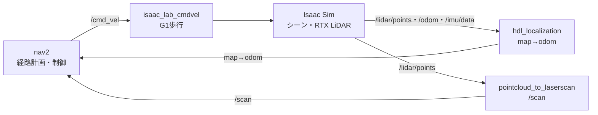

# Isaac Sim ナビゲーション 実行手順（環境構築済みからの起動ガイド）

humanoid-isaac-ros2 / G1 humanoid（Isaac Sim 5.0 + ROS 2 Humble + Nav2）

本書は、環境構築（`nav2_environment_setup.md` 第1〜3部）が**済んだ状態から**、シミュレータを起動してナビゲーションを実行するまでの**運用手順**をまとめたものです。コマンド・パス・起動順は `nav2_environment_setup.md` と一致させています。

---

## 0. 全体構成



| 要素 | 役割 | 実行場所 |
|---|---|---|
| Isaac Sim（`run_locomotion.sh`） | シーン・G1歩行・RTX LiDAR | **ホスト** |
| hdl_localization | 自己位置推定（map→odom） | **ホスト**・docker（`lidar_localization:humble`） |
| pointcloud_to_laserscan | `/lidar/points` → `/scan` | **nav_vnc コンテナ内** |
| nav2（bringup_no_amcl） | 経路計画・制御 | **nav_vnc コンテナ内** |
| RViz | 可視化・ゴール指示 | **nav_vnc コンテナ内**（VNC `DISPLAY=:1`） |

すべて **CycloneDDS / `ROS_DOMAIN_ID=0` / `use_sim_time:=true`** で統一します。

---

## 1. 前提（環境構築が済んでいること）

`nav2_environment_setup.md` 第1〜3部により、次が用意済みであること：

- Python venv `env_isaaclab_2.2`（Isaac Sim 5.0 / Isaac Lab 2.2）
- `nav_vnc` コンテナ作成済み・`setup.sh` 実行済み（ROS 2 ワークスペース構築済み）
- hdl 用イメージ `lidar_localization:humble`（ビルド済み、またはプロキシ環境では配布tarを `docker load`。`nav2_environment_setup.md` §3.3）

---

## 2. 共通の環境設定（nav_vnc 内の各端末で）

`nav_vnc` 内で作業する端末ごとに、まず次を実行します（`nav2_environment_setup.md` §3.4 と同じ）。

```bash
docker exec -it nav_vnc bash                 # ホストでコンテナに入る（root プロンプト）
# ↓ nav_vnc コンテナ内
source /opt/ros/humble/setup.bash
source /ros2_ws/install/setup.bash          # poc_launch / poc_utils を含む
export RMW_IMPLEMENTATION=rmw_cyclonedds_cpp
export ROS_DOMAIN_ID=0
```

RViz だけは VNC 表示の都合で `-u ubuntu` を付けて入ります（§5 ④）。

---

## 3. Isaac Sim（シーン＋G1歩行）の起動 — ホスト

venv を有効化して起動スクリプトを実行します（`nav2_environment_setup.md` 第2部と同じ）。

```bash
source ~/env_isaaclab_2.2/bin/activate
cd ~/work/humanoid-isaac-ros2
./HumanoidPoC/scripts/run_locomotion.sh
```

→ 既定では標準シーン（`HumanoidPoC/scripts/usds/lightwheel_factory_sample.usd`）で G1 が起動し、`/cmd_vel`・`/odom`・`/imu/data`・`/lidar/points` を出します。

> **RTX LiDAR は Isaac Sim のウィンドウが前面（アクティブ）でレンダリング中のときだけ点群を出します。** 最小化・非アクティブだと空の点群になり、`/scan`・hdl が止まります。**ナビ中は Isaac を前面に保ってください。**

起動確認（ホストで ros2 を使う場合は `./HumanoidPoC/scripts/ros2_host.sh topic ...`、または nav_vnc 内で）：

```bash
ros2 topic list | grep -E "cmd_vel|odom|imu/data|lidar/points"
ros2 topic hz /lidar/points     # 点群が流れているか
```

---

## 4. 地図の選択（既存をそのまま使う / 作り直す）

ナビのパイプライン（hdl → `pcd2pgm` 由来の占有格子 → nav2）は**地図非依存**です。整合した地図さえあれば同じ手順で動きます。地図は次の2要素で、両方が**同一座標系**である必要があります。

- **占有格子（`*_occgrid.yaml` / `.pgm`）** … nav2 の経路計画用（2D）
- **点群（`*_with_intensity.pcd`）** … hdl の自己位置推定用（3D）

### A. 作成済みの地図をそのまま使う（通常はこちら）

付属の地図をそのまま使います。§5 の nav2（`map:=`）と hdl（`GLOBALMAP_PCD=`）で、使う地図に合わせてパスを指定します。

| 地図 | nav2 `map:=` | hdl `GLOBALMAP_PCD=` |
|---|---|---|
| lightwheel（既定） | `/volume/maps/lightwheel_map/lightwheel_map_occgrid.yaml` | compose 既定（`/maps/lightwheel_map_with_intensity.pcd`） |

### B. 地図を作り直す

新しい環境から地図を作る場合は、`nav2_environment_setup.md` の手順で占有格子と `*_with_intensity.pcd` を生成してから、A の要領で使います。

- **SLAM から作る** … 第4部（GLIM → PLY → PCD → `pcd2pgm`）

→ シーン（§3 の USD）と地図（PCD/PLY）は**同一座標系**であることが必要です。

---

## 5. ナビの起動（① hdl → ② pointcloud_to_laserscan → ③ nav2 → ④ RViz）

laserscan が出す `/scan` を nav2 が使うため、**nav2 より先に laserscan** を起動します。

### ① hdl_localization（ホスト・`<repo>/HumanoidPoC/ros2` で）

```bash
cd ~/work/humanoid-isaac-ros2/HumanoidPoC/ros2
docker compose -f docker/docker-compose.hdl_localization.yml up lidar-localization pcd-publisher
```

ログに `Global Map Received` / `DONE` が出れば globalmap 読込成功です。

### ② pointcloud_to_laserscan（nav_vnc 内）

```bash
docker exec -it nav_vnc bash                  # ホストでコンテナに入る（root プロンプト）
# ↓ nav_vnc コンテナ内
source /opt/ros/humble/setup.bash
source /ros2_ws/install/setup.bash            # poc_launch / poc_utils を含む
export RMW_IMPLEMENTATION=rmw_cyclonedds_cpp
export ROS_DOMAIN_ID=0

ros2 run pointcloud_to_laserscan pointcloud_to_laserscan_node \
  --ros-args --params-file /volume/pc2_to_scan_cfg/pc2_to_scan.yaml \
  -r cloud_in:=/lidar/points -r scan:=/scan -p use_sim_time:=true
```

### ③ nav2（bringup_no_amcl）（nav_vnc 内・別ターミナル）

使う地図に合わせて `map:=` を指定します（§4 の表）。

```bash
docker exec -it nav_vnc bash                  # ホストでコンテナに入る（別ターミナル・root プロンプト）
# ↓ nav_vnc コンテナ内
source /opt/ros/humble/setup.bash
source /ros2_ws/install/setup.bash            # poc_launch / poc_utils を含む
export RMW_IMPLEMENTATION=rmw_cyclonedds_cpp
export ROS_DOMAIN_ID=0

ros2 launch poc_launch bringup_no_amcl.launch.py use_sim_time:=true \
  map:=/volume/maps/lightwheel_map/lightwheel_map_occgrid.yaml \
  params_file:=/volume/nav2_cfg/nav2_params_maxV1.0_humble.yaml
```

ログに `Managed nodes are active` が出れば nav2 起動完了です。

### ④ RViz（nav_vnc 内・VNC デスクトップ `DISPLAY=:1`）

`root` のまま実行すると `could not connect to display :1` になるため、`ubuntu` ユーザで入って起動します。

```bash
# ホストで: ubuntu ユーザとして nav_vnc に入る（別ターミナル）
docker exec -u ubuntu -e DISPLAY=:1 -e XAUTHORITY=/home/ubuntu/.Xauthority -it nav_vnc bash
# ↓ nav_vnc コンテナ内（ubuntu）
source /opt/ros/humble/setup.bash
source /ros2_ws/install/setup.bash            # poc_launch / poc_utils を含む
export RMW_IMPLEMENTATION=rmw_cyclonedds_cpp
export ROS_DOMAIN_ID=0

ros2 run rviz2 rviz2 -d /volume/rviz2_cfg/humanoid_navigation_by_uzawa.rviz
```

noVNC（6080）が未起動でブラウザから見たい場合は、nav_vnc 内で次を実行します。

```bash
websockify --web /usr/lib/novnc 6080 localhost:5901
```

→ ブラウザで **http://localhost:6080/vnc.html** → Connect → パスワード `ubuntu`

---

## 6. ナビ実行

1. **Isaac Sim を前面に**（LiDAR を生かす）。
2. RViz で地図とロボットが見えることを確認。位置がズレていれば **「2D Pose Estimate」** で初期姿勢を与える。
3. **「Nav2 Goal」** で目標地点を指定 → G1 が歩いて移動。

> costmap が表示されない場合は、RViz の Map 表示の QoS Durability を **Transient Local** にしてください（同梱の `humanoid_navigation_by_uzawa.rviz` は設定済みです）。

---

## 7. 動作確認（検証コマンド）

```bash
ros2 run tf2_ros tf2_echo map odom        # hdl が自己位置推定（map→odom が出る）
ros2 run tf2_ros tf2_echo odom base_link  # Isaac の odometry（odom→base_link）
ros2 topic hz /scan                       # /scan が出ているか
ros2 topic info -v /cmd_vel               # nav2→Isaac 結線（subscriber が isaac_lab_cmdvel なら正常）
```

期待値：

- `map→odom`：hdl が出力（localization 成立）
- `odom→base_link`：Isaac が出力（更新中）
- `/cmd_vel`：publisher = nav2（behavior_server / velocity_smoother）、subscriber = `isaac_lab_cmdvel`

---

## 8. よくある見え方・注意点

- **LiDAR が空**：Isaac ウィンドウが非アクティブ。前面に戻す。
- **local_costmap が global_map より下に見える**：`map→odom` の z オフセット（脚ロボットの上下動＋3D自己位置の性質）による見た目。2Dナビは (x, y, θ) のみ使うため無害。
- **PCD が PGM（地図）にめり込んで見える**：2D地図（平面）が3D点群を輪切りにしているだけの見た目。XY は一致（PGM は同じ PCD から `pcd2pgm` 生成）。無害。
- 地図を取り直す場合は、**LiDAR が点を出している（Isaac アクティブ）状態で GLIM を開始**すること。

---

## 9. 既知の問題：hdl をソースからビルドできない → 配布イメージを使う

`setup.sh` の一括ビルドや hdl の Dockerfile ビルドは、`hdl_global_localization` の取得・ビルドで失敗することがあります（現在 `koide3/hdl_global_localization` は GitHub で参照不可。またプロキシ環境では `git clone` 自体がブロックされます）。

**hdl は配布済みイメージ `lidar_localization:humble` を `docker load` して使えば、ソースのビルド不要で運用できます**（手順は `nav2_environment_setup.md` §3.3）。

```bash
gunzip -c /path/to/lidar_localization_humble.tar.gz | docker load   # → lidar_localization:humble
docker images lidar_localization:humble                              # 登録確認
```
